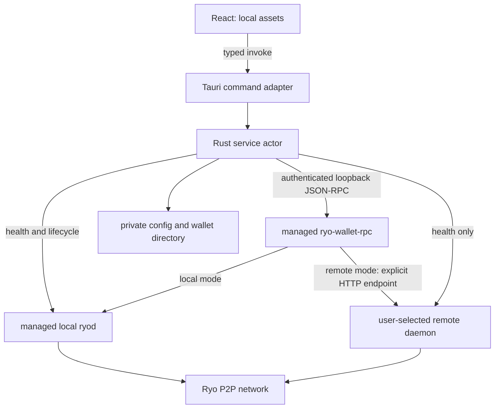
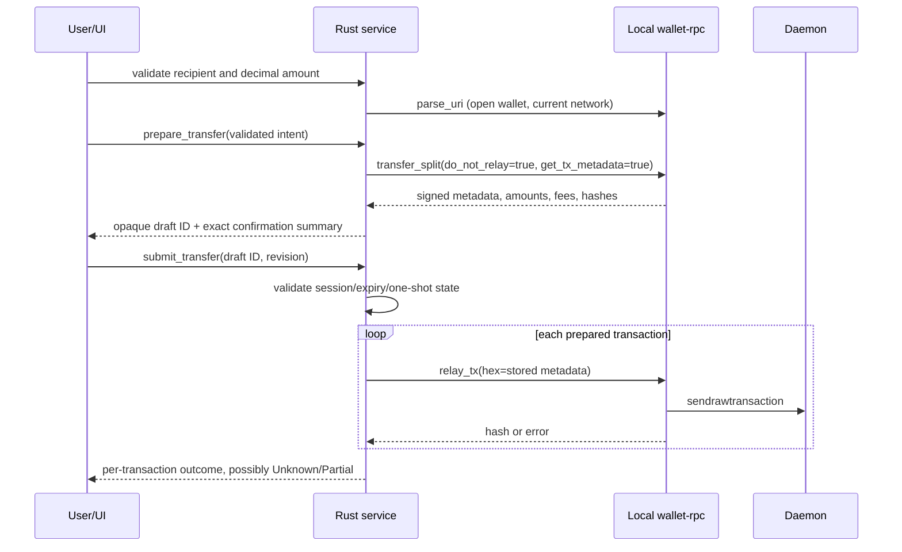

# Architecture

Status: source-informed architecture with a partially implemented Phase 1 foundation; real Ryo runtime validation remains pending. Ryo evidence is detailed in [UPSTREAM_ANALYSIS](UPSTREAM_ANALYSIS.md). Decisions are recorded in [ADR](ADR/README.md).

## Repository and dependency direction

```text
ryo-wallet/
├── Cargo.toml                     # workspace, resolver 3; two members
├── Cargo.lock
├── rust-toolchain.toml
├── package.json / pnpm-lock.yaml
├── components.json               # shadcn generation configuration
├── vite.config.ts / tsconfig.json
├── src/
│   ├── app/                      # shell, provider, navigation
│   ├── api/                      # invoke wrappers + generated domain DTOs
│   ├── features/                 # onboarding, wallets, overview, send,
│   │                             # receive, activity, settings
│   ├── components/ui/            # reviewed shadcn source
│   └── styles/
├── crates/ryo-wallet-service/
│   ├── Cargo.toml
│   ├── src/
│   │   ├── lib.rs
│   │   ├── domain/               # amount, wallet, network, transfer, error
│   │   ├── application/          # service actor, lifecycle, sends, events
│   │   ├── rpc/                  # transport, digest, wallet, daemon, wire
│   │   ├── process/              # supervisor, binary_manifest, platform
│   │   └── storage/              # paths, config, imports, submission journal
│   └── tests/                    # fixtures, fake child, RPC integration
├── src-tauri/
│   ├── Cargo.toml / build.rs / tauri.conf.json
│   ├── capabilities/ / permissions/
│   ├── binaries/                 # build inputs; no ad hoc downloads
│   └── src/                      # commands, DTO bindings, adapters, main/lib
├── tests/                        # frontend and app smoke tests
└── docs/
```

Two crates initially: reusable `ryo-wallet-service` and the Tauri executable/library package. A separate types crate and separate daemon/wallet client crates do not yet have independent consumers or release cycles. Public domain API stays separate from private wire DTOs inside the library. Split crates only when an actual consumer warrants it. Dependency direction: Tauri → application → domain + RPC/process/storage adapters. No Tauri, React or JavaScript dependency in the reusable library.

## Exact frontend baseline

Registry `latest` metadata queried 2026-09-22; use exact pins when scaffolding, then commit lockfiles. The frontend dependency set has resolved and its typecheck, lint and Vite build passed locally. The native Tauri build and pinned CI toolchain versions remain separate gates; see [implementation status](IMPLEMENTATION_STATUS.md).

| Package | Proposed pin |
| --- | --- |
| React / React DOM | 19.3.0 / 19.3.0 |
| TypeScript | 6.0.3 |
| Vite / @vitejs/plugin-react | 8.3.0 / 6.1.1 |
| Tailwind CSS / @tailwindcss/vite | 4.3.3 / 4.3.3 |
| shadcn CLI | 4.21.0 |
| pnpm | 12.5.1 |
| @tauri-apps/api / @tauri-apps/cli | 2.11.1 / 2.11.5 |
| @tanstack/react-query | 5.103.2 |
| Vitest | 5.0.1 |

Use Node **24.21.0 LTS**, observed in the [official release listing](https://nodejs.org/en/about/previous-releases), and pin it during scaffolding; the selected build/test engines require at least Node 22.12 or a compatible later version. shadcn components are generated source, not a runtime CDN library: retain notices and pin generated primitive/icon dependencies in the actual lockfile. Select React 19-compatible primitives via the pinned generator, then inspect their source. Local QR generation, no remote QR service. No React compiler, router framework, Redux or Next.js in the MVP.

TypeScript 7.0.2 was initially considered, but `typescript-eslint` 8.70.1 declares `<6.1.0`; the implemented set uses TypeScript 6.0.3. Evidence: npm registry metadata endpoints, e.g. [Vite](https://registry.npmjs.org/vite/latest), [React](https://registry.npmjs.org/react/latest), [TypeScript](https://registry.npmjs.org/typescript/latest), [pnpm](https://registry.npmjs.org/pnpm/latest), [plugin-react](https://registry.npmjs.org/@vitejs/plugin-react/latest), [Tailwind integration](https://registry.npmjs.org/@tailwindcss/vite/latest), [shadcn](https://registry.npmjs.org/shadcn/latest), [Query](https://registry.npmjs.org/@tanstack/react-query/latest), [Vitest](https://registry.npmjs.org/vitest/latest). These live endpoints can move; the table records the observed values. [shadcn's Vite setup](https://ui.shadcn.com/docs/installation/vite) supports the chosen integration.

Rust baseline candidates observed from crates.io: Tauri 2.11.6, Tokio 1.53.1, reqwest 0.13.5, serde 1.0.229, serde_json 1.0.151, thiserror 2.0.20, zeroize 1.9.0 and ts-rs 12.0.1. Select one current stable Rust toolchain satisfying all MSRVs and record its exact version in Phase 1 after Cargo resolution. Rust patches/MSRV compatibility are not certified by registry metadata alone. Reqwest's transport is not itself a guarantee of Digest support: select and audit an existing Digest implementation against epee fixtures, without inventing authentication cryptography. [Tauri crate metadata](https://crates.io/api/v1/crates/tauri), [reqwest metadata](https://crates.io/api/v1/crates/reqwest).

## Process and node model



Rust starts one wallet-rpc for the active wallet/network context, and optionally one app-owned ryod. Never attach wallet-rpc to a remote host or let React choose arbitrary RPC methods. Managed RPC listeners bind explicitly to 127.0.0.1; the remote-mode exception is an **outbound** connection to a user-selected daemon. P2P networking is distinct from RPC and required in local mode.

Choose Local or Remote explicitly during onboarding. No hybrid/bootstrap mode in MVP: Atom implements it with `--bootstrap-daemon-address`, adding trust switching and health ambiguity. [src-electron/main-process/modules/daemon.js — `start`](https://github.com/ryo-currency/ryo-wallet/blob/6c8d0aa68245271fe0e781084b38583abf758869/src-electron/main-process/modules/daemon.js#L137). No automatic switch to a public server on local failure.

Current core CLI uses plaintext HTTP in the inspected path. MVP remote support is explicit HTTP with a clear one-time privacy/transport notice; default recommendation is local mode. Authenticated public HTTP endpoints are not offered as secure transport. HTTPS input is rejected as unsupported in this compatibility profile; never strip the scheme. A user-managed authenticated tunnel is an advanced external setup, not app-managed MVP infrastructure. It must remain logically untrusted. A Rust TLS bridge could be a future separate module, but would need to forward binary sync endpoints as well as JSON and is not hidden in the initial scope. Evidence: [src/wallet/wallet2.cpp — `make_basic`](https://github.com/ryo-currency/ryo-currency/blob/185dd1fa33ba88c88bb22df9069ad368c0f9a27e/src/wallet/wallet2.cpp#L256), [src/wallet/wallet2.h — `init`](https://github.com/ryo-currency/ryo-currency/blob/185dd1fa33ba88c88bb22df9069ad368c0f9a27e/src/wallet/wallet2.h#L616). Maintainer-supported TLS would supersede this limitation.

`NodeConfig` stores mode, network, bounded host/port and explicit trust class. A managed local daemon is trusted; arbitrary local endpoints and remote endpoints are not. Network mismatch checks use daemon flags and pinned expected genesis/header data when fixtures become available, never port number alone. Reconfirm that a remote node can lie even when these checks pass. No seed/password ever goes to a daemon.

## Lifecycle contract

Service state: `Stopped → Starting → Locked → Opening → Open → Closing → Locked`; fatal subprocess failure enters `Faulted`. Sync state is separate. One actor owns transitions, a bounded operation queue and one active wallet RPC request at a time. Native HTTP deadlines do not prove server-side cancellation; after a timed-out mutation enter reconciliation/unknown state before accepting another mutation.

Startup: enforce one app instance per data root; create owner-only network-specific directories; locate and verify binary manifest; allocate ports with bounded collision retry; launch by absolute path/argv, private working directory, controlled environment and closed stdin. Do not probe/adopt a foreign process merely because it answers on a port. Retrieve generated wallet-RPC login from the private directory, validate ownership/type/size and establish authenticated `get_languages` readiness. Match binary identity before invoking `--version`: an unverified executable must not run just to ask its version.

Use known manifest hashes plus version output and required-method probes. There is no wallet `get_version`; daemon has its own protocol version, not a substitute. Startup timeout must distinguish binding failure, missing credentials, bad authentication and slow backend. If an instance loses its response during create/restore, inspect destination artifacts and reconcile instead of repeating creation blindly.

Open existing: native file selection in Rust → copy wallet/key companions into a fresh internal wallet ID directory → validate containment and unsupported type/account policy → open through RPC → retrieve domain snapshot. Do not modify imported originals. App metadata stores display names separately from internal filenames. Refuse concurrent writers; an app lock cannot prevent an unrelated legacy wallet from opening the same original, hence copies.

Lock: disable commands and invalidate draft tokens immediately, clear UI state, then request `stop_wallet` while wallet is open and await child exit. Do not advertise completed lock before the key-bearing process has exited. When RPC is empty, graceful OS termination is used; `close_wallet` followed by `stop_wallet` cannot work reliably. Escalate from graceful wait to OS termination to kill after measured deadlines; report an interrupted save. Preserve files for recovery. [src/wallet/wallet_rpc_server.cpp — `on_stop_wallet`](https://github.com/ryo-currency/ryo-currency/blob/185dd1fa33ba88c88bb22df9069ad368c0f9a27e/src/wallet/wallet_rpc_server.cpp#L1374); [src/wallet/wallet_rpc_server.h — `stop_wallet_backend`](https://github.com/ryo-currency/ryo-currency/blob/185dd1fa33ba88c88bb22df9069ad368c0f9a27e/src/wallet/wallet_rpc_server.h#L79).

Node switching: invalidate drafts → stop wallet backend safely → health-check new daemon/network → restart wallet-rpc with new daemon settings → ask for password to reopen. Do not persist a password to make switching seamless. Persist selected settings only after validation, with rollback to the previous configuration available. Stop only app-owned daemons; remote daemons must never receive stop requests. On normal app exit stop wallet first, then owned daemon via `/stop_daemon` or OS fallback. That endpoint is unavailable on a restricted daemon RPC listener. [src/rpc/core_rpc_server.h — `/stop_daemon`](https://github.com/ryo-currency/ryo-currency/blob/185dd1fa33ba88c88bb22df9069ad368c0f9a27e/src/rpc/core_rpc_server.h#L127).

Crash recovery: record owner instance nonce, process start identity, executable hash and data root; do not kill by reused PID alone. Unix process groups/parent-death handling and Windows Job Objects are platform implementations requiring tests. macOS needs explicit ownership/recovery because Linux-specific parent-death mechanisms do not apply. On restart never auto-open or auto-submit. Reconcile interrupted submissions after unlock, check files and allow a safe rescan; never delete damaged wallets automatically.

## RPC boundary and domain models

Rust RPC transport: fixed loopback wallet endpoint, Digest authentication, bounded connect/read/overall deadlines and body sizes, no proxy environment inheritance, no redirects, explicit request IDs and typed response validation. Treat malformed data, missing fields, JSON-RPC errors and daemon `status != OK` independently. Transport DTOs use u64 for wire amounts; IPC adapters convert to canonical digit strings. Do not expose raw response objects or raw exception strings.

| Domain type | Fields / invariant |
| --- | --- |
| `AtomicAmount` | checked u64; IPC digit string, no exponent/sign/fraction; user decimal parsing limited to 9 places |
| `Network` | Mainnet, Testnet, Stagenet internally; test networks isolated; no automatic fallback |
| `WalletId`, `SessionId` | opaque app IDs; no frontend-selected filesystem paths |
| `WalletState` | lifecycle, session generation, active wallet summary, freshness |
| `Balance` | total, unlocked, locked, account scope, observed_at; no float |
| `ReceiveAddress` | exact upstream address, network; optional upstream-generated payment URI |
| `Transaction` | txid, direction/status, amount/fee strings, height/time optional, account/index context |
| `SyncStatus` | wallet height, daemon height/target, phase, observed_at, stale flag; no fabricated ETA |
| `NodeStatus` | mode, network, readiness, latency, last success, transport/trust class |
| `PreparedTransfer` | opaque draft ID, expiry, destination/ID, amount, fee/total, hash list, revision |
| `SubmissionResult` | per-hash NotAttempted / Submitted / Confirmed / Failed / Unknown; overall partial state |
| `AppError` | typed code, safe message key, retry action, diagnostic ID; private cause retained only after redaction |

Service commands cover: wallet list/import selection/create/restore/open/lock; one-time seed backup; password change; balance/address/history; input validation; prepare/cancel/submit; sync/node state; node configuration; basic settings. No generic file, URL, process or RPC command. IDs and numeric bounds are revalidated in Rust. Add rate limits to expensive operations and reject unknown fields where appropriate.

## Typed Tauri boundary and frontend state

Tauri command functions are thin async adapters: deserialize DTO → validate → dispatch to the service actor → map domain result. Manage an `Arc` service handle through Tauri state; never hold a global mutex across a network await. Service event sinks are plain Rust interfaces; Tauri maps them into targeted, redacted events. Generate TS **domain DTOs only** with ts-rs, maintain a small typed wrapper per invoke command, and test command names and result schemas together. Generated types are not runtime validation.

Use React component state for forms, dialogs and navigation; a small context for theme and current session; TanStack Query for read-only balance/history/status caches. No Zustand initially: it would duplicate those owners. Context alone would require manual cache invalidation; Query handles that limited job. On events invalidate affected query keys, coalesce updates and recover missed events with snapshots. Event envelopes include protocol version, session generation and monotonically increasing sequence. Ignore late responses from old sessions; unsubscribe on teardown.

Secret operations use direct invoke wrappers, **not Query mutations** whose variables can remain cached. Password/seed fields are short-lived uncontrolled inputs read on submit; reset DOM and references in finally/unmount/lock paths. Never use URL state, localStorage, persisted Query cache or devtools for secrets. Keep one-time seed backup outside shared context. UI reads account-scoped query keys and empties all wallet caches on lock. Sensitive diagnostics are disabled in production builds.

## Transfer protocol



Single recipient in MVP, but upstream can split into multiple transactions. Always show summed amount/fees/total and the number of transactions. `get_tx_keys=false`, `get_tx_hex=false`; retain metadata privately. Verify response list lengths, hashes, nonzero amounts and checked totals against requested intent before exposing a confirmation. Bind draft to wallet/session/network/node revision and exact recipient/payment ID. One outstanding draft; default expiry proposal 2 minutes, to be measured. Cancel erases metadata and invalidates token; wallet-rpc has no dedicated cancel RPC in this map. Service prevents competing preparation and keeps expiry conservative. [src/wallet/wallet_rpc_server.cpp — `fill_response / on_transfer_split / on_relay_tx`](https://github.com/ryo-currency/ryo-currency/blob/185dd1fa33ba88c88bb22df9069ad368c0f9a27e/src/wallet/wallet_rpc_server.cpp#L693).

Submit accepts only a draft ID and revision, never frontend amount, fee or metadata. Atom-style app password hashes are unnecessary: session was unlocked through the upstream wallet implementation; explicit confirmation authorizes relay. Idle lock terminates the session. Any later reauthentication requirement must use wallet verification, not a new local password hash scheme. A compromised renderer can still invoke an allowed submit command: confirmation inside the same renderer is not an independent trusted display.

Before the first relay, durably write a private, minimal submission-intent journal with request ID, wallet ID and prepared hashes (no keys/metadata/seed). Record progress after each result. Timeout, crash or generic relay error produces Unknown unless rejection is proven. Keep remaining transactions unsubmitted on uncertainty and reconcile hashes with history and daemon transaction/pool queries after refresh. Absence on one node is not proof of non-broadcast. Never automatically construct a replacement payment; do not persist signed metadata for cross-restart replay. UI tells the user to resolve uncertainty before sending again. [src/wallet/wallet2.cpp — `commit_tx`](https://github.com/ryo-currency/ryo-currency/blob/185dd1fa33ba88c88bb22df9069ad368c0f9a27e/src/wallet/wallet2.cpp#L4481).

## Error mapping

| Public error | Evidence / rule |
| --- | --- |
| IncorrectPassword | upstream -22 |
| WalletNotFound | service-owned missing path; generic RPC error alone is insufficient |
| InvalidAddress | -2, or failed controlled plain-address parse_uri validation |
| InvalidPaymentId | -5 or typed local hex validation |
| InsufficientBalance | -17/-37; show total versus unlocked context |
| DaemonUnavailable | daemon transport or wallet -38; busy (-3) distinguished |
| WalletRpcUnavailable | owned wallet process exited / transport unavailable |
| WalletNotSynchronized | conservative service readiness/freshness policy |
| TransactionRejected | only verified daemon rejection; generic relay -4 may be Unknown |
| NetworkMismatch | demonstrated config/daemon network conflict |
| BackendVersionMismatch | binary not in verified supported profile or required probe fails |
| SubmissionUnknown / PartialSubmission | ambiguous or mixed per-hash outcomes |
| UnsupportedWalletType / InvalidSeed / WalletCorrupt | verified type or narrowly classified failure; otherwise BackendError |

Source: [src/wallet/wallet_rpc_server_error_codes.h](https://github.com/ryo-currency/ryo-currency/blob/185dd1fa33ba88c88bb22df9069ad368c0f9a27e/src/wallet/wallet_rpc_server_error_codes.h); [src/wallet/wallet_rpc_server.cpp — `handle_rpc_exception / on_relay_tx`](https://github.com/ryo-currency/ryo-currency/blob/185dd1fa33ba88c88bb22df9069ad368c0f9a27e/src/wallet/wallet_rpc_server.cpp#L2520). Unknown RPC code remains BackendError with a diagnostic ID, not a guessed friendly cause.
